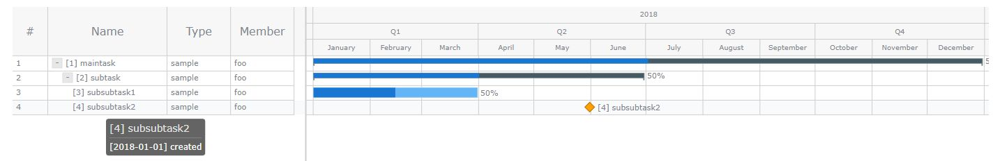

# CUI Task Scheduler

last update:07/25/2018

This application is for managing tasks by CUI.

---
#### Configuration
Task DB file and JavaScript file for Gantt Chart can be specified in "config.ini" respectively in case of shraing Task List with other team members.    

```
dbfile = ./db/db_schedule.json
jsfile = ./js/schedule.js
```

---
#### How to Run
Enter the following command from command prompt.
```
> python schedule.py
```
or
```
> schedule.exe
```
(Optional)
Task DB file can be specified by an argument instead of Configuration described in the above section.
 - Op1 ) Full file path of Task DB file ended in \".json\" -> Use/Create the specified json file.    
```
python schedule.py C:\temp\db_schedule_sample.json
```

_example_
 - Op2 ) Task DB name without \".json\" -> Use/Create the specified json file in ./db folder.    

_example_
```
python schedule.py db_schedule_sample
```


---
#### Command List
*For Help*    
- -h : show command list    
- key? : show key of task item    
- type? : show available types of task    

*For Display Items*     
- list : show title list    
- all : show all tasks    
- chart : create ganntchart and open in browser    
- update : update ganntchart

*For New Task*    
- add : add main task    
- sub : add sub task    
- del : delete task    

*For Status Change*    
- open : set status as [doing] and set start date    
- close : set status as [done] and set completion date    
- pending : set status as [pending]    
- progress : change progress (%)     

*For Information Update*    
- title : change title
- member : change member    
- due : change due date    
- note : add note in description.    

*For Query*    
- delay? : check delayed task    
- search : search task by keyword    
- mytask : show tasks for the specified member    

*For Application Control*    
- quit : exit application    

---
#### Task Item
Each task consists of the following information.     
(These information can be checked by "key?" command.)

- id : ID of task
- title : title of task
- type : type os task
- member : responsible of task
- created : creation date
- due : due date
- open : start date
- close : completion date
- description : description of task
- status : current status(todo, open, close, pending, delayed)
- progress : progress of task (%)

---
#### Gannt Chart
Gannt Chart is shown on your browser by "chart" command.
   

Description of each task can be seen during a mouse over the task name.    

